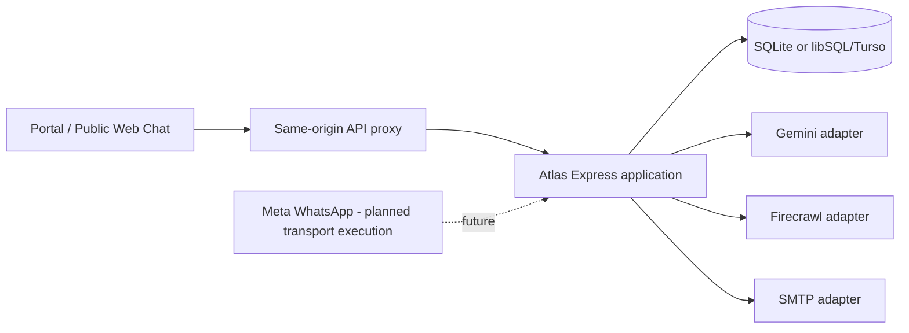
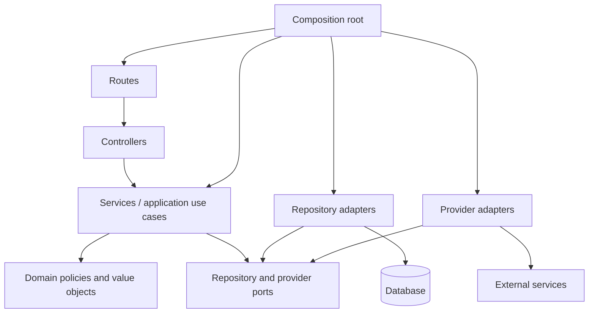
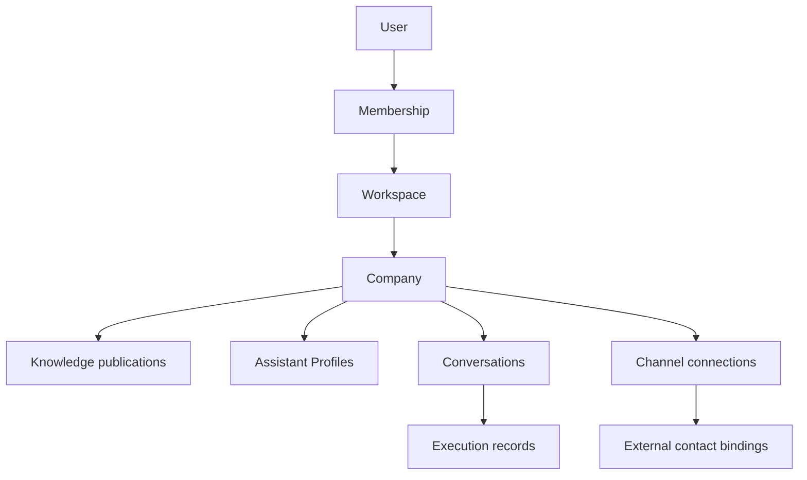
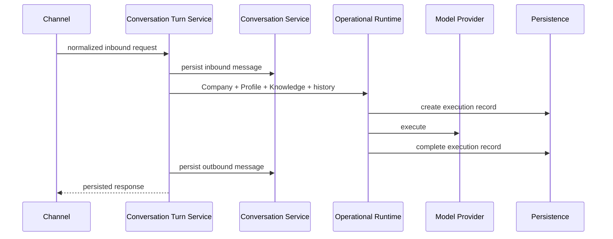
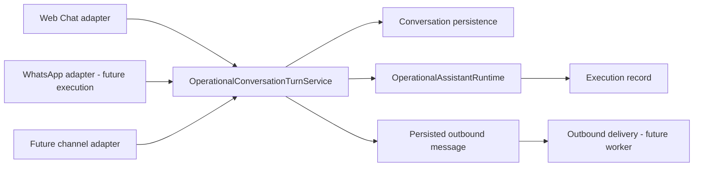
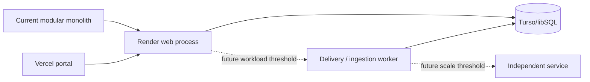

# Atlas Platform Architecture

## 1. Purpose

This document is the long-lived architectural reference for Atlas. It records the system as it is implemented, the invariants future work must preserve, and the already-established direction for evolution. It is not a product backlog or a replacement for epic-specific engineering plans.

## 2. Scope

Atlas is a multi-tenant customer-assistant platform. A Company owns knowledge, Assistant Profiles, conversations, channel connections, and operational history within a Workspace. Atlas currently runs as one TypeScript/Express application with local SQLite development persistence and libSQL/Turso production persistence.

This document covers platform boundaries, dependency rules, tenancy, runtime, knowledge, conversations, channels, persistence, security, testing, deployment, and evolution. It does not define provider-specific API payloads or user-interface behavior.

## 3. Architecture Vision

### North Star

Atlas is transport-neutral, multi-tenant, modular, and provider-independent. Company knowledge is the product; channels are interfaces to the same operational assistant. A channel may change, an AI provider may change, and a Company must not need to rebuild its business knowledge or assistant configuration.

Atlas is intentionally a modular monolith. It favors explicit in-process boundaries and durable persistence before introducing distributed infrastructure.

## 4. Architectural Principles

1. Knowledge belongs to the Company, not to a model or channel.
2. Every customer-facing response is grounded in published Company knowledge and an eligible Assistant Profile.
3. A channel is a transport adapter, never a separate assistant or conversation engine.
4. Workspace scope is the authorization boundary; Company scope is the operational ownership boundary.
5. Controllers stay thin; services own business rules; repositories own persistence; providers own external communication.
6. Domain code does not depend on HTTP, SQLite, provider SDKs, or browser concerns.
7. Secrets exist only in backend configuration or a future credential boundary, never in channel connection DTOs.
8. Database constraints are authoritative for ownership, uniqueness, idempotency, and lifecycle facts that must survive process restarts.
9. Failure responses must not disclose hidden tenants, resources, credentials, or provider internals.
10. Prefer the smallest correct extension over a generic abstraction introduced before a second real use case exists.

## 5. Current Platform Overview

Atlas consists of an Express backend and a React portal. The backend starts through `backend/src/index.ts`, creates the application in `backend/src/app.ts`, and wires production dependencies in `backend/src/composition.ts`.

The backend contains authenticated Company administration routes, public Web Chat routes, identity routes, workspace routes, and health/readiness routes. Production uses Render for the backend and Turso/libSQL for persistence; the portal is designed to use a same-origin `/api` rewrite.

This diagram represents the current platform with planned WhatsApp transport execution explicitly marked as future.

## 6. Module Map

| Module | Responsibility and ownership | Dependencies |
|---|---|---|
| Identity | Users, authentication identities, password credentials, sessions, verification, enrollment | repositories, cryptographic and delivery ports |
| Workspaces | Workspaces, memberships, invitations, permissions, selected workspace | Identity users, workspace repositories |
| Companies | Company lifecycle and workspace-owned business records | Company repository |
| Knowledge | Sources, revisions, publication, knowledge versions, ingestion safety | Companies, repositories, extraction/provider ports |
| Assistant Profiles | Profile configuration, readiness, lifecycle, preview eligibility | Company scope, profile repository |
| Runtime | Assistant execution, execution records, immutable profile/knowledge snapshots | execution port, profiles, knowledge |
| Conversations | Conversations, participants, messages, channel metadata | Company scope, conversation repository |
| Web Chat | Public connection/session transport adapter | Conversations, runtime, profiles |
| WhatsApp | Connection configuration and future sender/conversation binding | Companies, profiles, conversations |
| Transport | Provider event/message references and outbound-delivery persistence | Conversations and channel connection references |
| Deployment | Database selection, migrations, health/readiness, environment validation | configuration and composition root |

Modules are mature when they have explicit domain types, services, repositories, tests, and production composition wiring. Identity, Workspaces, Knowledge, Assistant Profiles, Runtime, and Web Chat are established. Conversations, WhatsApp, and Transport are emerging modules.

## 7. Dependency Rules

### Allowed dependencies

### Forbidden dependencies

- Routes and controllers must not query SQLite or call model/provider SDKs.
- Repositories must not contain channel, authorization, or provider business rules.
- Providers must not choose Company, Workspace, Assistant Profile, or conversation behavior.
- Runtime code must not import Web Chat or WhatsApp DTOs.
- Domain modules must not import Express, database adapters, or provider SDKs.
- Authentication providers and communication transport providers must remain different concepts.

### Composition root responsibilities

`composition.ts` selects concrete repositories, providers, clocks, policies, and route-controller factories. It is the only place that should know the production implementation graph. It must not become an application-service layer.

## 8. Atlas Kernel

Atlas has a conceptual kernel shared by modules. These are not instructions to move code into a new package.

| Concept | Current implementation | Meaning |
|---|---|---|
| TenantScope | `WorkspaceContext` | Trusted workspace scope used by repositories and services |
| AuthorizationContext | membership decision and actor context | Authenticated actor, role, capabilities, and resolved workspace |
| Company | Company record and Company ID | Operational owner of knowledge, profiles, conversations, and channels |
| Conversation | Conversation domain | Persistent customer interaction container |
| AssistantTurn | `OperationalConversationTurnService` input/result | One grounded inbound-to-outbound operational turn |
| RuntimeResult | assistant execution result | Answered or safe fallback outcome |
| ExecutionRecord | assistant execution record | Immutable audit snapshot of profile, knowledge, provider, outcome |
| ExternalIdentity | WhatsApp `wa_id` binding is partial implementation | Future provider-specific external contact identity |
| ChannelConnection | Web Chat and WhatsApp connection models | Channel-specific Company/Profile attachment |

## 9. Multi-tenant Model

Workspace is the primary authorization boundary. A Company belongs to one Workspace. Memberships grant role-derived capabilities within a Workspace. Company resources are visible only through a resolved Workspace context.

Enforcement occurs at several layers:

- The authorized Company router authenticates the session, resolves membership, derives permission, and creates trusted workspace context.
- Services validate Company/profile/connection relationships.
- Repositories use workspace and Company joins for scoped reads and writes.
- Migrations use foreign keys, unique constraints, checks, and cascades.
- Tests assert cross-workspace and cross-Company non-disclosure.

## 10. Identity & Authorization

Identity owns internal Users and authentication identities. Current authentication is password/session based with verified email and credential enrollment. Sessions are opaque, server-side records with CSRF state and expiry controls.

Workspace authorization is distinct from authentication. `PermissionPolicy` derives capabilities from membership roles: owner, administrator, operator, and viewer. Company routes generally use `company:read` for reads and `company:manage` for mutations.

The authenticated Company router applies no-store cache headers and generic `404` responses for authentication, authorization, workspace-resolution, origin, Fetch Metadata, and CSRF failures. This deliberately avoids resource-existence disclosure.

Future Google, Meta, Microsoft, or OIDC login belongs to authentication identity evolution. It must not share a `Provider` abstraction with WhatsApp, Web Chat, or other communication channels.

## 11. Assistant Runtime

`OperationalAssistantRuntime` executes an Assistant Profile against a published Company knowledge snapshot through an execution port. It persists an execution record before provider work and records answered, safe fallback, or failed outcome after execution.

`OperationalConversationTurnService` validates Company readiness, profile executability, published knowledge availability, open conversation state, and participant ownership. It persists inbound message, bounded chronological history, execution record, and outbound message.

The runtime does not know the transport that initiated a turn.

## 12. Knowledge

Knowledge is Company-owned and versioned. Sources create revisions; publication selects a coherent published knowledge version. Assistant execution uses published knowledge rather than mutable source input.

Knowledge ingestion is deliberately separated from publication. A Company can be configured before it is operationally ready, but runtime execution requires Company readiness and current published knowledge.

Provider extraction, URL acquisition, PDF extraction, and Gemini interactions are adapters. Knowledge business rules remain in services/domain logic.

## 13. Conversations

Conversations are Company-owned persistent records with `internal`, `web_chat`, or `whatsapp` channel metadata. Participants are neutral records with type/reference fields. Messages have inbound/outbound direction, content, optional idempotency key, and optional execution-record link.

Conversation state is `open|closed`. Messages are appended chronologically and are not channel-specific. This is the foundation shared by Web Chat and future WhatsApp execution.

Current per-process turn serialization uses `InMemoryConversationTurnLock`. It prevents overlapping turns in one process but is not a distributed coordination mechanism.

## 14. Channels

### Web Chat

Web Chat is implemented. A Web Chat connection binds a Company and executable Assistant Profile, exposes an opaque public ID, and creates cookie-backed anonymous sessions. Sessions create a conversation and neutral visitor/assistant participants. Public Web Chat uses the shared turn service and runtime.

### WhatsApp

WhatsApp is an emerging channel. Phase 1 created:

- WhatsApp connection persistence.
- Unique Phone Number ID mapping.
- Connection plus `wa_id` conversation bindings.
- Provider event/message references.
- Durable outbound-delivery persistence.

Phase 2 adds authenticated Company-scoped connection management. It separates configuration from operation: connections may be configured with a non-archived profile, while activation requires an executable profile. Webhook verification, inbound parsing, Graph API delivery, credentials, and workers are not implemented.

### Future channels

Instagram, Messenger, Telegram, SMS, and email should be channel-specific adapters using shared conversation/runtime contracts. They should not force Web Chat or WhatsApp into a universal persistence inheritance hierarchy before genuine common requirements exist.

## 15. Persistence Strategy

Local development and tests use `node:sqlite`. Production requires libSQL/Turso. Migrations are additive, checksum-protected, transactionally applied, and recorded in `schema_migrations`.

Repositories are the persistence boundary. They use tenant joins and database constraints rather than trusting route parameters. Important constraints include Company/workspace ownership relationships, unique Assistant Profile normalized names, unique Web Chat public IDs, unique WhatsApp Phone Number IDs, WhatsApp connection plus `wa_id` bindings, provider external event IDs, provider external message IDs, and outbound delivery uniqueness.

No migration should be modified after release. New schema changes must be additive and tested against migration/restart behavior.

## 16. Error Strategy

Modules define validation, not-found, conflict, and policy errors. Controllers translate them into safe HTTP responses. Expected patterns are:

- `400` for malformed input.
- `404` for scoped absence and non-disclosing authorization failure.
- `409` for lifecycle, uniqueness, or optimistic-concurrency conflicts.
- `5xx` with generic client messages for unexpected failures.

Error bodies must not include database constraints, provider payloads, secrets, hidden tenant identities, or stack traces.

## 17. Security Invariants

- Credentials, tokens, app secrets, verification tokens, and provider-secret references never appear in frontend DTOs or ordinary connection records.
- Mutation routes require authenticated session, valid CSRF token, exact origin, and same-origin Fetch Metadata.
- Webhook authentication must later use raw-body signature verification before parsing payloads.
- A provider payload never chooses Workspace, Company, profile, or credential authority.
- WhatsApp inbound resolution must use configured Phone Number ID only.
- External identifiers are persisted only where necessary for idempotency and conversation binding and must not be logged with message content.
- Public Web Chat sessions use opaque token digests and HttpOnly cookies.

## 18. Observability

Atlas currently has health/readiness endpoints, execution records, persistent conversation messages, provider-event records, and outbound-delivery state as operational evidence. Logging must use safe correlation identifiers and categorized error codes, not secrets, raw payloads, signatures, tokens, phone numbers, or message content.

Near-term observability should connect inbound provider event, conversation turn, execution record, outbound message, and delivery record through safe internal identifiers.

## 19. Testing Philosophy

Atlas favors local, deterministic tests against real SQLite persistence and real route wiring where security boundaries matter. Tests should validate:

- Domain validation and lifecycle rules.
- Repository tenant isolation and database constraints.
- HTTP authentication, authorization, CSRF, origin, Fetch Metadata, headers, and safe DTO behavior.
- Migration/restart integrity.
- Provider adapters through controlled fakes rather than live credentials.
- Composition wiring without requiring external providers.

The full backend suite is serial to avoid nondeterministic database contention. Production provider calls and real credentials are not test prerequisites.

## 20. Deployment Model

Production is an Express web service on Render with libSQL/Turso persistence. The React portal runs on Vercel and proxies browser `/api` traffic to Render to preserve same-origin security behavior. Local SQLite files are not production data stores.

The worker and dedicated-service nodes are future evolution, not current deployment components.

## 21. Roadmap

### Current

- Workspace tenancy, authenticated administration, Company knowledge, Assistant Profiles, runtime, conversations, Web Chat, WhatsApp persistence, and WhatsApp connection management.

### Near-term

- WhatsApp signed inbound webhook.
- Inbound event idempotency and conversation binding execution.
- Persisted outbound delivery worker and Graph API adapter.
- Provider credential boundary and operational connection health.
- Transport correlation/observability.

### Future

- More transport adapters using shared turn/runtime contracts.
- Worker extraction when operational metrics justify it.
- External contact/CRM, actions, scheduling, analytics, and billing.

## 22. Explicit Non-goals

- A separate assistant runtime per channel.
- A generic connection hierarchy before multiple proven channel requirements exist.
- Frontend storage of provider credentials.
- OAuth/social login as part of transport work.
- Microservices for appearance rather than measured need.
- Automatic retries for ambiguous external delivery outcomes.
- Provider-specific business logic inside the runtime or conversation modules.

## 23. ADR Index

Existing ADRs establish the architecture baseline, modular-monolith direction, Workspace tenancy boundary, and provider-neutral AI capability direction. Future ADRs should record these additional established or emerging decisions:

1. Runtime is transport-neutral.
2. Channel connections remain channel-specific with shared conceptual contracts.
3. Provider credentials are isolated from connection DTOs and authentication identities.
4. External message/event idempotency is database-backed.
5. WhatsApp connection updates use optimistic concurrency through `updatedAt`.
6. External provider I/O must not occur inside long-lived database transactions.
7. Worker extraction requires measurable operational thresholds.

## 24. Conclusion

Atlas has a credible modular-monolith foundation for a multi-tenant, transport-neutral assistant platform. Its strongest architectural assets are workspace-scoped authorization, published knowledge, profile/runtime separation, persistent conversations, and channel adapters that reuse the same turn engine.

Future work should extend these contracts rather than duplicate them. The next architectural priority is completing WhatsApp as a transport adapter: signed inbound handling, durable delivery, and credential isolation while preserving the existing tenancy, runtime, and conversation invariants.
